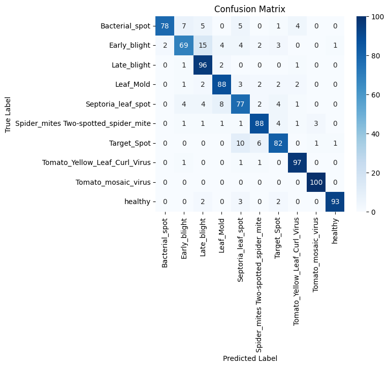
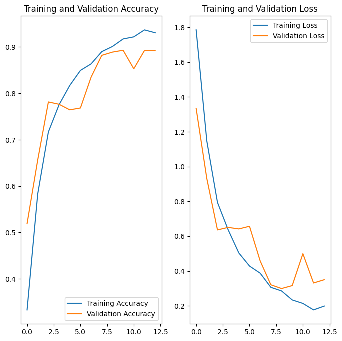
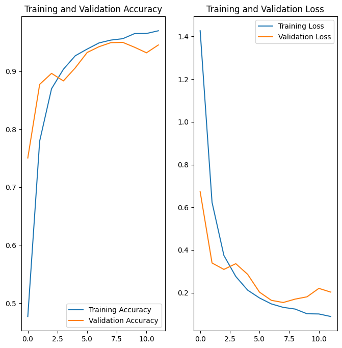

# Tomato Disease Classification – Raspberry Pi

Classify tomato leaf diseases using a CNN deployed on a Raspberry Pi with IoT sensors.

## Project Summary

This project tackles the classification of tomato leaf diseases using image data. We:

- Prepared and preprocessed a labeled dataset of tomato leaf images.
- Trained a Convolutional Neural Network (CNN) to recognize and classify disease categories from images.
- Evaluated the CNN's performance using a confusion matrix and classification report (see notebook for details).
- Post-training quantization. [See report](https://www.researchgate.net/publication/404732965_Post-Training_Quantization_and_Core_ML_Deployment_of_a_Tomato_Disease_Classifier_for_On-Device_Inference)

---

## Results

The CNN model was evaluated **with and without data augmentation**. The following metrics summarize the improvement:

### Comparison Table

| Model                  | Test Accuracy | Macro F1 | Weighted F1 |
|------------------------|---------------|----------|-------------|
| CNN (no augmentation)  | 0.87          | 0.87     | 0.87        |
| CNN (with augmentation)| 0.92          | 0.92     | 0.92        |

---

### Confusion Matrices

**Left:** CNN without augmentation &nbsp;&nbsp;|&nbsp;&nbsp; **Right:** CNN with augmentation

  
   

---

### Training Curves

**Left:** CNN without augmentation &nbsp;&nbsp;|&nbsp;&nbsp; **Right:** CNN with augmentation

  
   

---

## Takeaways

- Data augmentation greatly improved the model’s generalization (reducing potential shift issues) and accuracy.  
- CNN reached **92% test accuracy** with augmentation, compared to 87% without.  

---

## Tools

